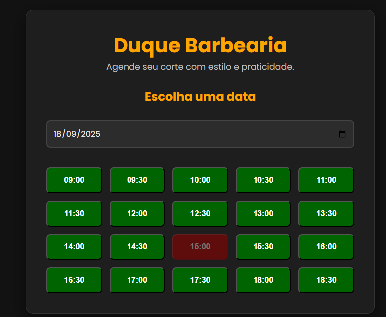
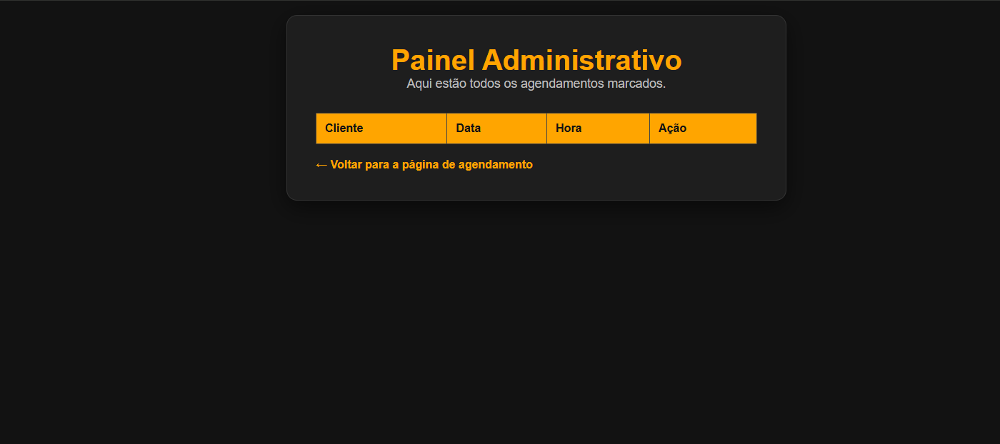
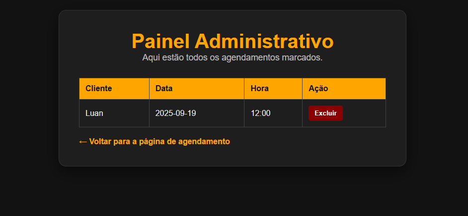
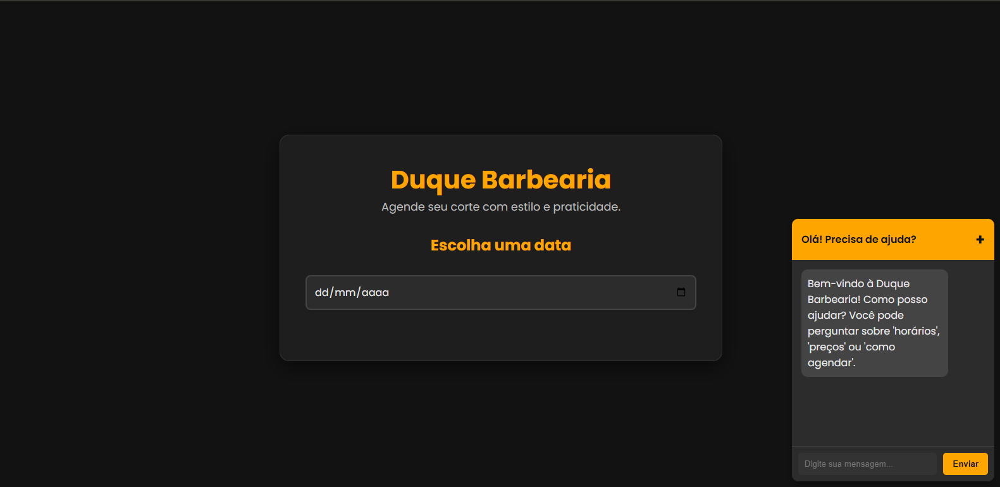

# 💈 Sistema de Agendamento para Barbearia com IA


Sistema web completo para o gerenciamento de agendamentos em uma barbearia, integrado com um assistente de IA (Google Gemini) para interações inteligentes.

---

## 🚀 Funcionalidades Principais

* **Agendamento Online:** Clientes podem visualizar horários disponíveis e marcar um serviço.
* **Painel Administrativo:** Área para o administrador gerenciar, confirmar e cancelar agendamentos.
* **Assistente com IA:** Chatbot integrado com a API do Gemini para responder dúvidas comuns dos clientes.
* **Autenticação de Usuários:** Sistema de login seguro para administradores e funcionários.
* **Banco de Dados:** Armazenamento persistente de clientes e agendamentos utilizando SQLite.

---

## 🛠️ Tecnologias Utilizadas

Este projeto foi construído com as seguintes tecnologias:

* **Backend:**
    * 
    * 
* **Frontend:**
    * 
    * 
    * 
* **Banco de Dados:**
    *  (Gerenciado com DB Browser for SQLite)
* **IA:**
    * Google Gemini API

---

## 🔧 Como Executar o Projeto Localmente

Siga os passos abaixo para rodar o projeto na sua máquina.

1.  **Clone o repositório:**
    ```bash
    git clone [https://github.com/SEU-USUARIO/NOME-DO-REPOSITORIO.git](https://github.com/SEU-USUARIO/NOME-DO-REPOSITORIO.git)
    cd NOME-DO-REPOSITORIO
    ```

2.  **Crie e ative um ambiente virtual:**
    ```bash
    # Windows
    python -m venv venv
    .\venv\Scripts\activate
    ```

3.  **Instale as dependências:**
    ```bash
    pip install -r requirements.txt
    ```

4.  **Configure as variáveis de ambiente:**
    * Crie um arquivo `.env` na raiz do projeto.
    * Adicione sua chave da API do Gemini: `GEMINI_API_KEY="SUA_CHAVE_AQUI"`
    * (Lembre-se de adaptar seu código para ler esta variável de ambiente em vez de tê-la no código)

5.  **Inicialize o banco de dados (se necessário):**
    ```bash
    python init_db.py
    ```

6.  **Execute a aplicação:**
    ```bash
    flask run
    ```
    Acesse `http://127.0.0.1:5000` no seu navegador.

---

## 📸 Screenshots

(# 💈 Sistema de Agendamento para Barbearia com IA
## 📸 Screenshots

Aqui estão algumas telas que demonstram o sistema em funcionamento:

**Tela de Agendamento de Horários**


**Agendamento Confirmado**


**Painel de Administração (Sem Agendamentos)**


**Painel de Administração (Com Agendamentos)**


**Exemplo de Interação com o Chatbot**


---

## Licença

Este projeto está sob a licença MIT. Veja o arquivo [LICENSE](LICENSE.md) para mais detalhes.